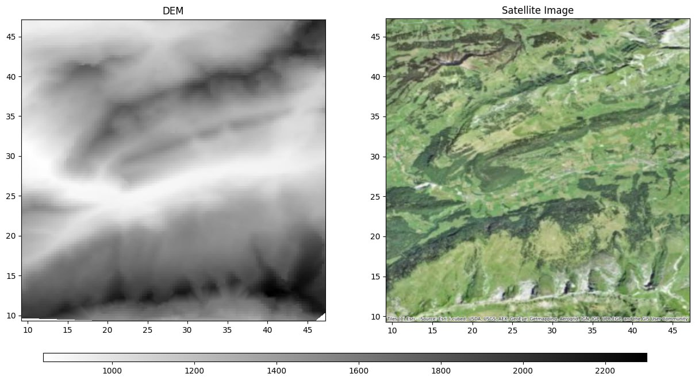
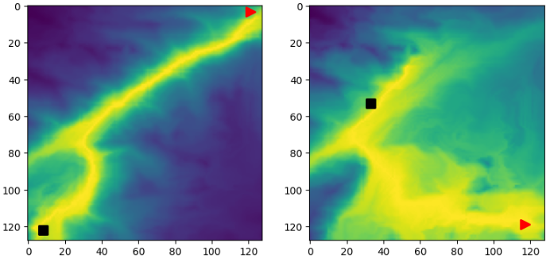

# Датасет для алгоритма TransPath: RGB

Информация об алгоритме:  

- Ссылка репозиторий с реализацией алгоритма: [TransPath](https://github.com/AIRI-Institute/TransPath)
- Ссылка на датасет (RGB + DEM) от авторов алгоритма: [Датасет для TransPath](https://disk.yandex.ru/d/LIMbKd4AZPEUdA)

### Описание датасета

Скачать датасет можно по ссылке: [Google.Disk](https://drive.google.com/drive/folders/13w1vhmvb4qOG7m7k2EF0VJGSw_Fjq65K), [Yandex.Disk](https://disk.yandex.ru/d/5OJ_EbvCsXu7xQ)

Содержание архивов:
- **train.npz** - данные для обучения;
- **train_focal.npz** - gt-разметка для обучения;
- **test.npz** - данные для теста;
- **test_focal.npz** - gt-разметка для теста;
- **val.npz** - данные для валидации;
- **val_focal.npz** - gt-разметка для валидации.

Описание датасета:
- источник RGB-изображений [Esri.WorldImagery](https://www.esri.com/en-us/capabilities/imagery-remote-sensing/capabilities/content)
- источник DEM-изображений [Earthdata.nasa](https://www.earthdata.nasa.gov/sensors/srtm)
- Размер одного изображения 128х128 px
- Строна изображения 128 px - это фактические 50 км на местности (0.1 градус)
- В наборе train 500 изображений, test - 250 изображений, val - 250 изображений
- В наборах *_focal.npz на каждое изображение создано по 10 изображений с gt-разметкой и точками старта и финиша

### Визуализация датасета

Визуализация спутниковых данных: 

Визуализация gt-разметки:

Обозначения на рисунках: 
- Треугольник - начало пути (точка старта).
- Квадрат - конец пути (точка финиша).

### Генерация датасета

**Gen_data.ipynb** - скрипт для сбора датасета.

Функция **fetch_osm_image**:
- Загружает спутниковое изображение из OSM для заданных координат (широта и долгота) и уровня масштабирования (zoom).
- Сохраняет изображение в указанный путь (output_path).
- Возвращает загруженное изображение и его географические координаты.

Функция **fetch_elevation_data**:
- Загружает данные о высотах для заданных координат с использованием SRTM.
- Создаёт сетку координат с заданным размером (size).
- Интерполирует данные высот для создания DEM (цифровой модели высот).

